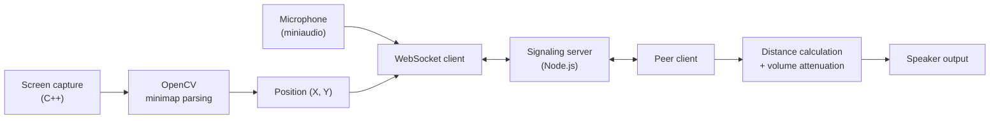

# LPVC — Proximity Voice Chat for League of Legends

Real-time proximity voice chat for League of Legends. Your teammate's voice fades in as they walk toward you on the map, and fades out as they leave. No game files touched, no memory injection — the client reads the minimap the same way you do, with your eyes.

Built from scratch with C++, OpenCV, Node.js and WebSockets.


---

## How it works

The client never talks to the game. It watches the screen, finds where you are, and streams that position alongside your microphone audio.



**Computer vision.** The C++ client continuously captures the screen and reads the League minimap, isolating the white camera bounding box to pinpoint your exact `(X, Y)` coordinates on Summoner's Rift.

**Real-time networking.** Coordinates and raw microphone bytes are packed and streamed to a Node.js signaling server over WebSockets.

**Spatial audio.** When the client receives a peer's audio and position, it computes the geometric distance between both players. Close by, volume sits at 100%. As the distance grows, volume fades until the peer is fully muted.

Because nothing is read from game memory and no files are patched, the application is a standalone screen reader — it runs in the background with minimal resource usage.

---

## Tech stack

| Layer | Technology |
| --- | --- |
| Client | C++ |
| Computer vision | OpenCV |
| Audio capture & playback | miniaudio |
| Transport | WebSockets |
| Signaling server | Node.js |

---

## Getting started

To play with a friend, one of you hosts the server; both of you run the client.

### Prerequisites

- **Node.js** (host only)
- **Radmin VPN** (both players) — or any virtual LAN you prefer
- The release package: `lol_proximity.exe` and `opencv_world4xx.dll`

> The client will not start without the OpenCV DLL in the same folder.

### 1. Start the server (host only)

```bash
cd LoL_Server
node server.js
```

Leave the terminal running in the background. The server listens on port `8080`.

### 2. Create the tunnel (host only)

The server runs on your local machine, so your friend needs a route to it. Create a network on Radmin VPN and share the name and password. Everyone joins it, then copies the Radmin IP address of the machine **hosting the server**.

### 3. Run the client (both players)

Launch `lol_proximity.exe`. When prompted for the server address, paste:

```
ws://26.14.208.117:8080
```

Replace the address with the host's Radmin IP. To test alone on the host machine, press `ENTER` with no input to connect to `localhost`.

---

## Project structure

```
LoL_Server/   Node.js signaling server
LoL_VPVC/     C++ client — capture, vision, audio
```

---

## Roadmap

- [ ] Hosted server, removing the Radmin VPN dependency
- [ ] English client interface (currently PT-BR)
- [ ] Packaged release with the DLL bundled
- [ ] Configurable audio falloff curve
- [ ] Support for more than two players

---

## Why I built this

Inspired by VPVC (Valorant Proximity Voice Chat), I wanted the same immersive — and frequently hilarious — experience on Summoner's Rift. Nothing like it existed for League, so I wrote it. 🇧🇷

---

## License

MIT. See [LICENSE](LICENSE).

---

## Disclaimer

This project is not affiliated with or endorsed by Riot Games. It reads only what is rendered on your screen and does not modify game files, memory, or network traffic.
